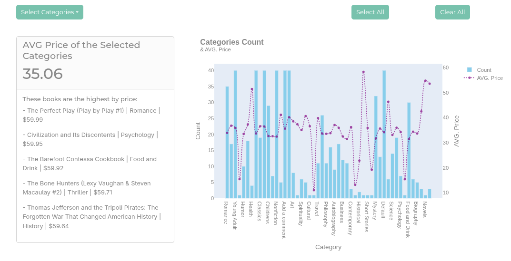

# Web Scraping & Dashboard Development

## Purpose
Scraped the website to get data about the books in it and visualize the data in a simple dashboard.


## Process
1. Before starting to write the script, i tested my code in jupyter lab.
2. Used my own classes and functions to make requests, extract links and export data to a duckdb database.
3. Made sure that data is saved correctly into the library database.
4. Developed a simple dashboard to show findings.

## Tools:
1. curl_cffi
2. selectolax
3. duckdb
4. jupyterlab
5. dash 
6. dash-bootstrap-components
7. plotly
8. pandas 

## To Run main.py:
do the same steps for both directories
1. First install uv:
```bash 
pip install uv
```

2. Run the following command to run main.py:
```bash 
uv run main.py 
```

## To view Jupyter Lab Notebook: 
1- First install dependencies:
```bash
uv sync
```

2- Second, change virtual environment:
```bash
source .venv/bin/activate
```

3- Finally, start jupyter lab:
```bash
jupyter lab
```

